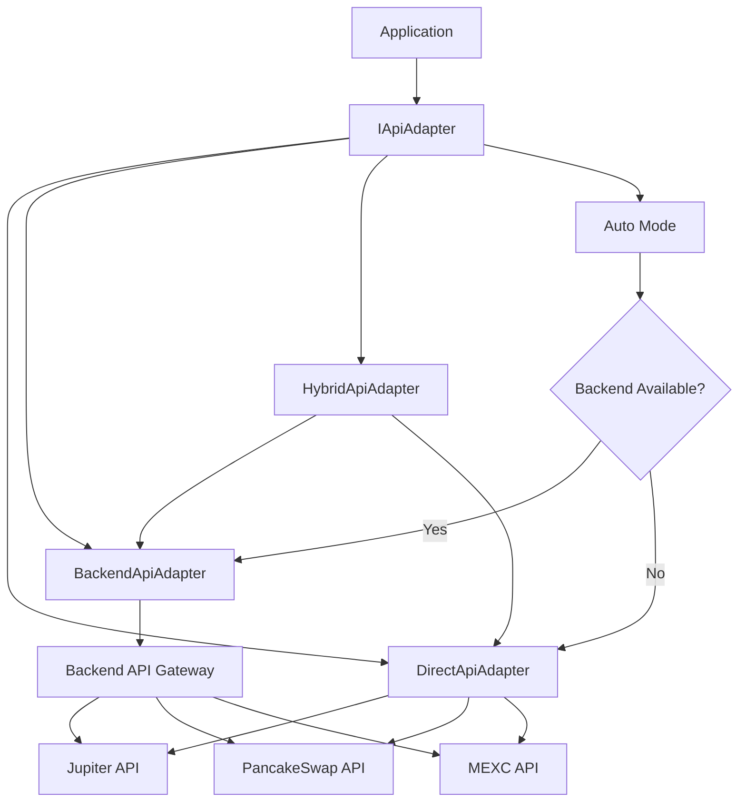
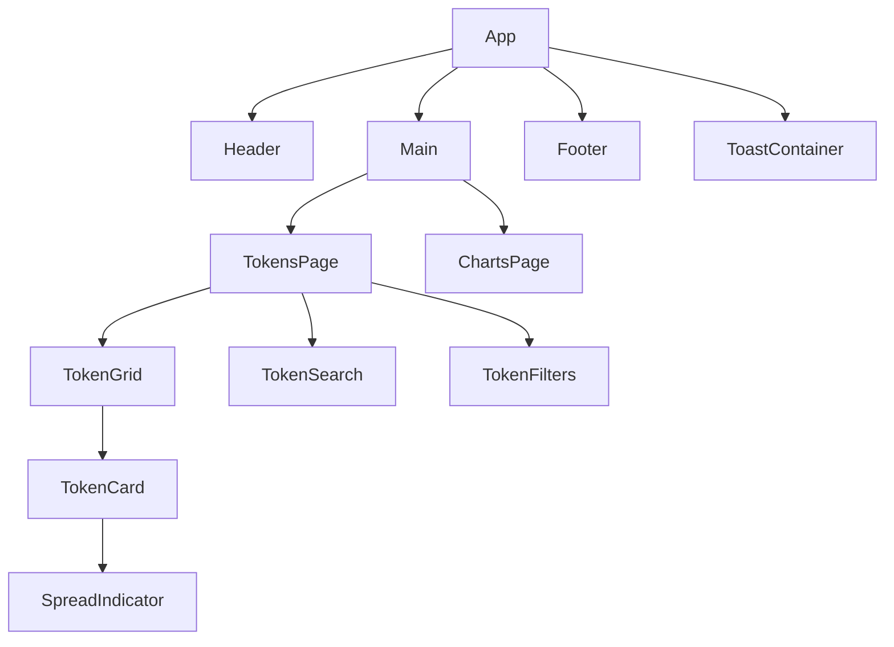
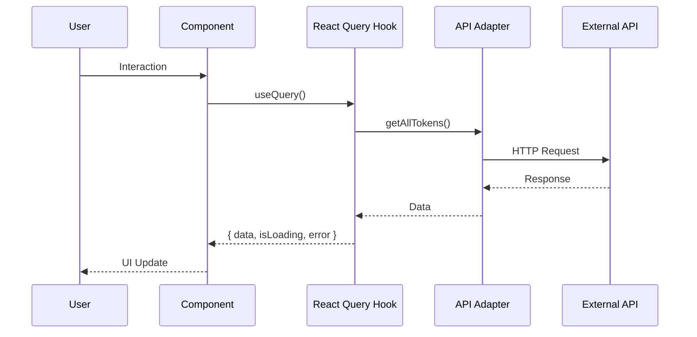

# 👨‍💻 Руководство для разработчиков

## Обзор

Этот документ предназначен для разработчиков, которые хотят понять архитектуру проекта, начать разработку или внести изменения в Shark Spread Tracker.

---

## 🚀 Быстрый старт

### Требования

- Node.js 18+ 
- npm или yarn
- Git

### Установка

```bash
# Клонировать репозиторий
git clone <repository-url>
cd SharkFront

# Установить зависимости
npm install

# Запустить dev сервер
npm run dev
```

### Первый запуск

1. Откройте `http://localhost:3000`
2. Проверьте, что приложение загружается
3. Проверьте консоль на наличие ошибок

---

## 📁 Структура проекта

```
SharkFront/
├── src/
│   ├── api/              # API слой
│   │   ├── adapters/     # API адаптеры (direct, backend, hybrid, auto)
│   │   ├── clients/      # HTTP клиенты (Jupiter, PancakeSwap, MEXC)
│   │   ├── endpoints/    # API эндпоинты
│   │   ├── hooks/        # React Query hooks
│   │   └── schemas/      # Zod схемы для валидации
│   ├── components/       # React компоненты
│   │   ├── features/     # Feature-компоненты
│   │   ├── layout/       # Layout компоненты
│   │   └── ui/           # UI компоненты
│   ├── contexts/         # React контексты
│   ├── lib/              # Библиотеки и утилиты
│   ├── locales/          # Переводы (i18n)
│   ├── pages/            # Страницы приложения
│   ├── types/            # TypeScript типы
│   └── utils/            # Утилиты
├── MD/                   # Документация
├── public/               # Статические файлы
└── e2e/                  # E2E тесты (Playwright)
```

---

## 🏗️ Архитектура

### API Adapter Pattern

Проект использует паттерн Adapter для переключения между режимами работы API:

```typescript
// Режимы работы
type ApiMode = 'direct' | 'backend' | 'hybrid' | 'auto';

// Использование
import { getAllTokens } from '@/api/adapters/api-adapter';
const tokens = await getAllTokens();
```

**Режимы:**
- `direct` - прямые вызовы к внешним API (по умолчанию)
- `backend` - вызовы через бэкенд API Gateway
- `hybrid` - бэкенд с автоматическим fallback на direct
- `auto` - автоматически определяет оптимальный режим

Подробнее: [API_DOCUMENTATION.md](./API_DOCUMENTATION.md)

### React Query

Используется для управления состоянием и кэшированием данных:

```typescript
import { useTokens } from '@/api/hooks/useTokens';

function MyComponent() {
  const { data, isLoading, error } = useTokens();
  // ...
}
```

**Настройки:**
- `staleTime`: 5 секунд
- `gcTime`: 5 минут
- `retry`: 3 попытки
- `refetchOnWindowFocus`: true

### State Management

- **React Query** - для серверного состояния
- **React Context** - для глобального UI состояния (тема, язык, toast)
- **Local State** - для локального состояния компонентов

---

## 🔧 Разработка

### Добавление нового компонента

1. Создайте компонент в соответствующей папке:
   - `src/components/ui/` - базовые UI компоненты
   - `src/components/features/` - feature-компоненты
   - `src/components/layout/` - layout компоненты

2. Следуйте структуре:
```typescript
// MyComponent.tsx
import { cn } from '@/utils/cn';

export interface MyComponentProps {
  className?: string;
  // ... другие пропсы
}

export function MyComponent({ className, ...props }: MyComponentProps) {
  return (
    <div className={cn('base-classes', className)}>
      {/* ... */}
    </div>
  );
}
```

3. Добавьте индексный файл:
```typescript
// index.ts
export { MyComponent } from './MyComponent';
export type { MyComponentProps } from './MyComponent';
```

4. Добавьте тесты:
```typescript
// __tests__/MyComponent.test.tsx
import { describe, it, expect } from 'vitest';
import { render, screen } from '@testing-library/react';
import { MyComponent } from '../MyComponent';

describe('MyComponent', () => {
  it('should render', () => {
    render(<MyComponent />);
    expect(screen.getByText('...')).toBeInTheDocument();
  });
});
```

### Добавление нового API эндпоинта

1. Создайте функцию в `src/api/endpoints/`:
```typescript
// my-api.ts
import { jupiterClient } from '../clients';

export async function getMyData(signal?: AbortSignal) {
  const response = await jupiterClient.get('/my-endpoint', { signal });
  return response.data;
}
```

2. Добавьте в адаптер (`src/api/adapters/api-adapter.ts`):
```typescript
export interface IApiAdapter {
  // ...
  getMyData(signal?: AbortSignal): Promise<MyData>;
}
```

3. Реализуйте во всех адаптерах (DirectApiAdapter, BackendApiAdapter, HybridApiAdapter)

4. Экспортируйте функцию:
```typescript
export const getMyData = async (signal?: AbortSignal) => {
  const adapter = await getApiAdapter();
  return adapter.getMyData(signal);
};
```

5. Создайте React Query hook:
```typescript
// useMyData.ts
import { useQuery } from '@tanstack/react-query';
import { getMyData } from '../adapters/api-adapter';

export function useMyData() {
  return useQuery({
    queryKey: ['myData'],
    queryFn: () => getMyData(),
  });
}
```

### Добавление перевода

1. Добавьте ключ во все файлы локализации:
   - `src/locales/en.json`
   - `src/locales/ru.json`
   - `src/locales/tr.json`

2. Используйте в компоненте:
```typescript
import { useLanguage } from '@/contexts/LanguageContext';

function MyComponent() {
  const { t } = useLanguage();
  return <div>{t('my.key')}</div>;
}
```

### Стилизация

Используется Tailwind CSS:

```typescript
import { cn } from '@/utils/cn';

<div className={cn(
  'base-classes',
  condition && 'conditional-classes',
  className
)}>
```

**Цветовая схема:**
- `dark-*` - тёмная тема
- `light-*` - светлая тема
- `primary-*` - основные цвета
- `success-*`, `error-*`, `warning-*` - статусные цвета

---

## 🧪 Тестирование

### Unit тесты

```bash
# Запустить все тесты
npm run test:run

# Запустить в watch режиме
npm test

# Запустить с покрытием
npm run test:coverage
```

### E2E тесты

```bash
# Запустить E2E тесты
npm run test:e2e

# Запустить в UI режиме
npm run test:e2e:ui
```

### Написание тестов

**Unit тест:**
```typescript
import { describe, it, expect } from 'vitest';
import { render, screen } from '@testing-library/react';
import { MyComponent } from './MyComponent';

describe('MyComponent', () => {
  it('should render correctly', () => {
    render(<MyComponent />);
    expect(screen.getByText('Hello')).toBeInTheDocument();
  });
});
```

**E2E тест:**
```typescript
import { test, expect } from '@playwright/test';

test('should load tokens page', async ({ page }) => {
  await page.goto('/');
  await expect(page.getByText('Tokens')).toBeVisible();
});
```

---

## 📊 Диаграммы архитектуры

### API Adapter Pattern



### Component Hierarchy



### Data Flow



---

## 🔍 Примеры кода

### Использование API Adapter

**Direct режим (по умолчанию):**
```typescript
// .env
VITE_API_MODE=direct

// Использование
import { getAllTokens } from '@/api/adapters/api-adapter';
const tokens = await getAllTokens();
```

**Backend режим:**
```typescript
// .env
VITE_API_MODE=backend
VITE_BACKEND_URL=https://api.backend.com

// Использование (то же самое)
import { getAllTokens } from '@/api/adapters/api-adapter';
const tokens = await getAllTokens();
```

**Hybrid режим:**
```typescript
// .env
VITE_API_MODE=hybrid
VITE_BACKEND_URL=https://api.backend.com
VITE_API_FALLBACK_ENABLED=true

// Использование (то же самое)
// Автоматически переключится на direct при ошибке бэкенда
```

**Auto режим:**
```typescript
// .env
VITE_API_MODE=auto
VITE_BACKEND_URL=https://api.backend.com

// Использование (то же самое)
// Автоматически определит оптимальный режим при первом вызове
```

### Создание React Query Hook

```typescript
import { useQuery } from '@tanstack/react-query';
import { getSpreadData } from '@/api/adapters/api-adapter';
import type { Token, TimeframeOption } from '@/types';

export function useSpreadData(
  token: Token,
  timeframe: TimeframeOption = '1h'
) {
  return useQuery({
    queryKey: ['spread', token.symbol, token.chain, timeframe],
    queryFn: () => getSpreadData(token, timeframe),
    staleTime: 30000, // 30 секунд
    gcTime: 300000, // 5 минут
  });
}
```

### Обработка ошибок

```typescript
import { useQuery } from '@tanstack/react-query';
import { getErrorMessage } from '@/utils/errors';
import { useToast } from '@/contexts/ToastContext';

export function useMyData() {
  const { error: showError } = useToast();
  
  return useQuery({
    queryKey: ['myData'],
    queryFn: async () => {
      try {
        return await getMyData();
      } catch (error) {
        const message = getErrorMessage(error);
        showError(message);
        throw error;
      }
    },
  });
}
```

### Использование состояний UI

```typescript
import { LoadingSpinner } from '@/components/ui/LoadingSpinner';
import { EmptyState } from '@/components/ui/EmptyState';
import { ErrorDisplay } from '@/components/ui/ErrorDisplay';

function MyComponent() {
  const { data, isLoading, error } = useMyData();
  
  if (isLoading) {
    return <LoadingSpinner />;
  }
  
  if (error) {
    return <ErrorDisplay error={error} />;
  }
  
  if (!data || data.length === 0) {
    return <EmptyState icon="inbox" title="No data" />;
  }
  
  return <DataList data={data} />;
}
```

---

## 🐛 Отладка

### Логирование

Используется `logger` из `@/utils/logger`:

```typescript
import { logger } from '@/utils/logger';

logger.debug('Debug message');
logger.info('Info message');
logger.warn('Warning message');
logger.error('Error message', error);
```

### React DevTools

- Установите [React DevTools](https://react.dev/learn/react-developer-tools)
- Используйте для отладки компонентов и состояния

### Network Tab

- Откройте DevTools → Network
- Проверьте API запросы
- Проверьте заголовки и ответы

### React Query DevTools

```typescript
import { ReactQueryDevtools } from '@tanstack/react-query-devtools';

function App() {
  return (
    <>
      {/* ... */}
      {import.meta.env.DEV && <ReactQueryDevtools />}
    </>
  );
}
```

---

## 📝 Best Practices

### Код

1. **Всегда используйте TypeScript** - типизация обязательна
2. **Следуйте ESLint правилам** - запускайте `npm run lint` перед коммитом
3. **Используйте Prettier** - форматирование кода автоматически
4. **Пишите тесты** - покрытие должно быть > 80%
5. **Документируйте код** - JSDoc комментарии для публичных функций

### Компоненты

1. **Разделяйте на UI и Feature компоненты**
2. **Используйте `React.memo` для оптимизации**
3. **Всегда обрабатывайте loading, error, empty состояния**
4. **Используйте `useLanguage` для всех текстов**
5. **Поддерживайте темную и светлую тему**

### API

1. **Всегда используйте AbortSignal для отмены запросов**
2. **Обрабатывайте ошибки с понятными сообщениями**
3. **Используйте React Query для кэширования**
4. **Логируйте все API вызовы**
5. **Используйте rate limiting**

### Производительность

1. **Используйте lazy loading для страниц**
2. **Оптимизируйте bundle size**
3. **Используйте code splitting**
4. **Кэшируйте данные через React Query**
5. **Оптимизируйте ререндеры с помощью `React.memo`**

---

## 🔗 Полезные ссылки

- [React Documentation](https://react.dev/)
- [TypeScript Documentation](https://www.typescriptlang.org/docs/)
- [Tailwind CSS Documentation](https://tailwindcss.com/docs)
- [React Query Documentation](https://tanstack.com/query/latest)
- [Vite Documentation](https://vitejs.dev/)
- [Vitest Documentation](https://vitest.dev/)
- [Playwright Documentation](https://playwright.dev/)

---

## 📚 Дополнительная документация

- [ARCHITECTURE.md](./ARCHITECTURE.md) - детальная архитектура
- [API_DOCUMENTATION.md](./API_DOCUMENTATION.md) - документация API
- [TESTING.md](./TESTING.md) - руководство по тестированию
- [DEPLOY.md](./DEPLOY.md) - инструкция по деплою
- [UX_STATES_GUIDE.md](./UX_STATES_GUIDE.md) - руководство по состояниям UI

---

**Последнее обновление:** 2024-12-20

